# NFC Reader/Writer for ACR1252U

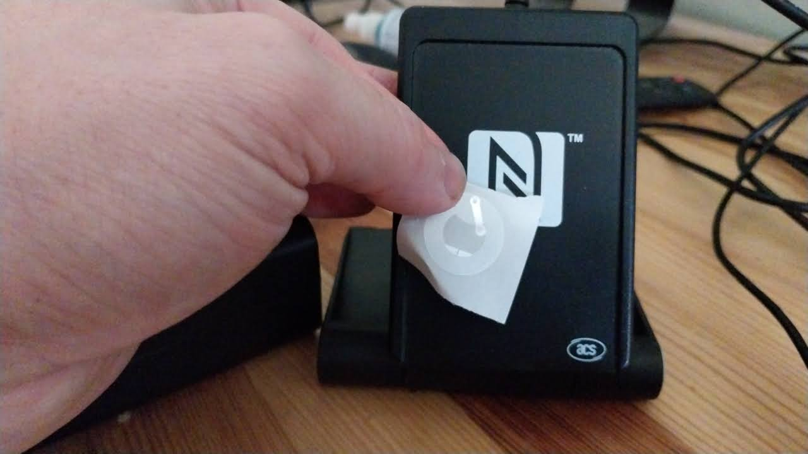

  


This is a Python implementation for reading and writing NFC tags using the ACR1252U NFC reader. The application features a modern dark-themed PyQt6 graphical interface with comprehensive NFC tag reading and writing capabilities.

## Key Features

- Modern dark-themed PyQt6 interface
- Real-time URL detection with clipboard support
- Comprehensive NDEF message interpretation
- Batch writing capability
- Tag locking functionality
- Detailed debug logging
- Chrome browser integration

## Screenshots - V5

### Writing Mode

The GUI supports the ability to write URLs to NFC tags and write and lock in one operation. 

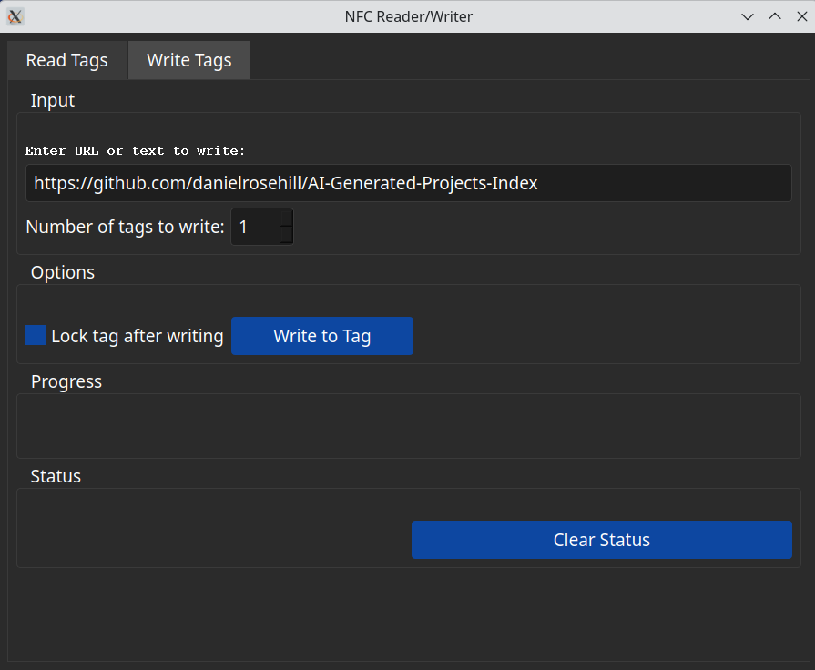

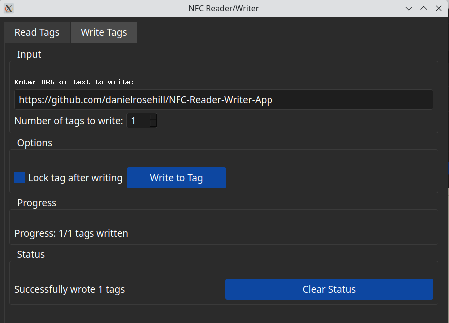

## Reading Mode

Reading mode supports continuous reading operation, detected URL display, and automatic opening of URLs in Google Chrome.

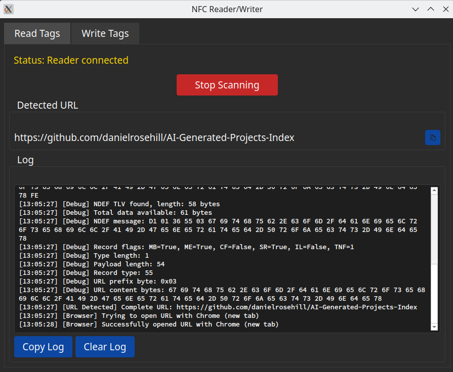

## Generated With Claude Sonnet 3.5 + Cline IDE!

This GUI for reading and writing NFC tags was a product of necessity and of the amazing advance in AI. 

In 2024 I stumbled upon the excellent [Homebox home inventory system](https://github.com/sysadminsmedia/homebox) and have been using it ever since. 

Well, initially I created QR codes םver time I shifted towards using NFC tags. 

Creating lots of NFC tags for an inventory system using a phone, however, is a tedious and slow process. Unfortunately, I couldn't get the only desktop NFC reader I could find to work on my particular variant of Linux. 

This turned out to be a perfect project for the nascent breed of AI development tools. As I learned through watching these tools code and by helping them to debug the errors, I learned that NFC tags are a lot more complicated than their tiny size would suggest!

I can't promise that this app will work on every computer and with every reader and tag. Nor can I equate this in any way to projects like NFC tools that were the product of human development and effort. But for my specific combination of hardware and tags, and perhaps yours, this works perfectly well and highly efficiently. 

The notes generated by Claude below are worth paying attention to because a large part of the difficulty in just starting out with this project was installing the right drivers in order to have the NFC reader writer detected on this variant of Linux. 

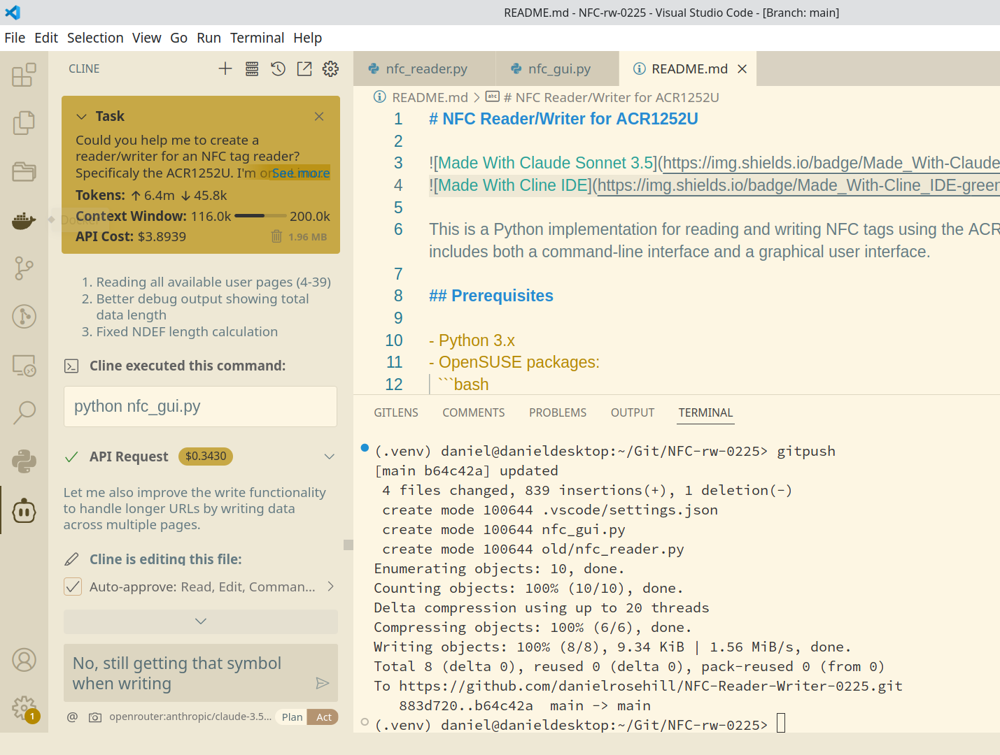

## My Home Inventory NFC Tagging Project

[](https://github.com/sysadminsmedia/homebox)

I began using NFC tags after noticing that the QR codes I initially used as my labeling system in my Homebox home inventory manager began to fade in discolor after only a year. 

Although I never expected that I'd actually stick to keeping my "stuff" in an inventory manager, I've, over time, come to embrace the approach! 

I prefer using NFC tags because I find them a bit more convenient to use. You can just top A tag with your phone and jump straight to its page in Homebox. This makes it quick and convenient to put stuff back in the right place, which is why I got into the system in the first place. 

Below are some photos of my setup before and after the move to NFC tags. 

### "V1" - QR Codes To Track Items

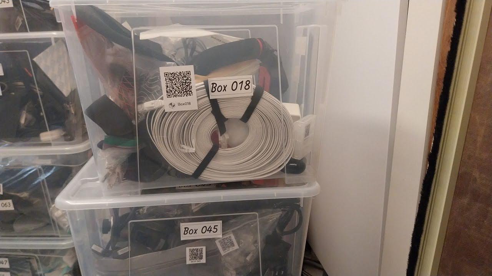

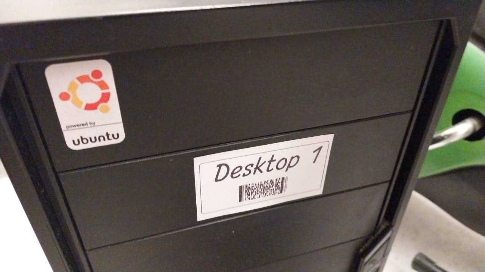

### "V2" - NFC Tags For Item Tracking

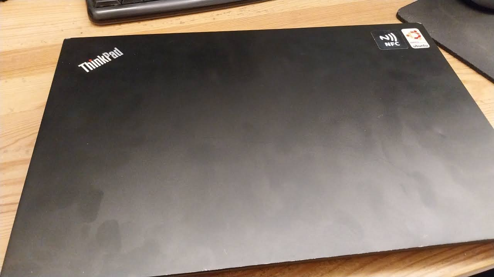

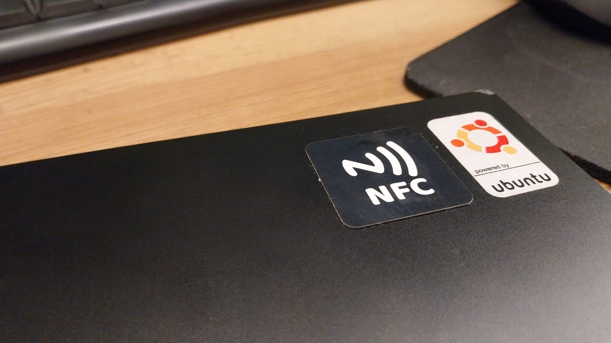

## NFC 213 (144 Bytes)

The type of NFC tag that I use in my system is NFC 213. 

These tags are affordable, perfect for use in inventory management sysetms, and can be purchased in bulk on Aliexpress. 

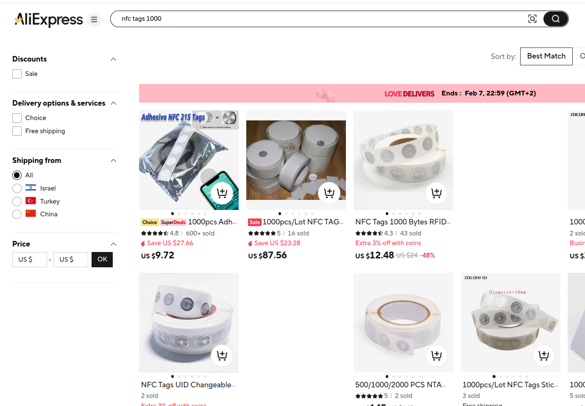

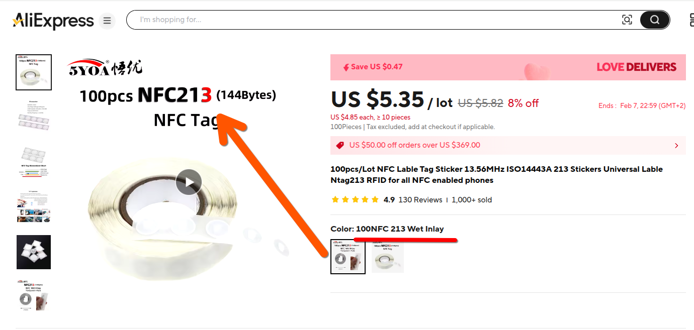


## My Testing Environment

- OpenSUSE Tumbleweed + KDE Plasma
 
# Claude Generated Readme

## Prerequisites

- Python 3.x
- OpenSUSE packages:
  ```bash
  sudo zypper install pcsc-lite-devel
  ```
- Python packages:
  ```bash
  pip install pyscard PyQt6
  ```

## Usage

### Command Line Interface
```bash
python nfc_reader.py
```

### Graphical User Interface
```bash
python nfc_gui.py
```

The GUI version provides:
1. Continuous tag scanning with automatic URL detection
2. Separate read and write interfaces
3. Automatic opening of URLs in Google Chrome
4. Tag locking functionality

## Features

### Command Line Interface
- Automatic detection of ACR1252U reader
- Read NFC tag UIDs
- NDEF message support
- Fallback to direct write for non-NDEF tags
- Interactive command menu

### GUI Interface
- Real-time tag scanning with debug information
- Automatic URL detection and Chrome browser integration
- Two-tab interface:
  1. Read Tab:
     - Continuous tag scanning
     - Real-time status updates
     - URL detection display with copy functionality
     - Detailed debug output showing:
       * Raw tag data
       * NDEF structure parsing
       * Content interpretation
       * URL detection steps
     - Automatic URL opening in Chrome
     - Comprehensive log display with copy/clear functions
  2. Write Tab:
     - Smart URL/Text detection
     - Proper NDEF formatting for both URLs and text
     - Batch writing support
     - Optional tag locking after writing
     - Debug output of written data
     - Progress tracking for batch operations
     - Status feedback
- Thread-safe operation
- Dark theme for improved visibility

### NTAG213 Support
- Optimized for NTAG213 memory structure
- Correct page addressing (starts at page 4)
- Proper NDEF formatting
- Compatible locking mechanism

## Supported Operations

### Reading Operations
- Universal tag UID reading
- NDEF message content reading with detailed parsing
- Automatic text content decoding
- URL detection with Chrome browser integration
- Continuous scanning mode with debug output
- Raw data inspection capabilities

### Writing Operations
- Smart URL/Text type detection
- Proper NDEF message formatting:
  * URL records (Type U)
  * Text records (Type T)
- NTAG213 memory layout compliance
- Tag locking support
- Batch writing capability
- Progress tracking
- Debug output of written data

## Interface Commands

### Command Line Interface
- `r` - Read tag (displays UID and NDEF content)
- `w` - Write raw data to tag (hex format)
- `t` - Write text as NDEF message
- `q` - Quit the application

### GUI Interface
#### Read Tab
- Start/Stop Scanning button
- Real-time log display with copy/clear functions
- URL detection display with copy support
- Automatic URL handling
- Detailed debug logging

#### Write Tab
- Text/URL input field
- Batch quantity selector
- Lock tag checkbox
- Write button
- Progress tracking
- Status display with clear function

## Error Handling

Comprehensive error handling for:
- Missing dependencies
- No readers found
- Connection errors
- Read/write errors
- NDEF parsing errors
- Invalid input formats

## Notes

- NDEF operations are attempted first for maximum compatibility
- Fallback to direct write operations for non-NDEF tags
- Make sure the pcscd service is running:
  ```bash
  sudo systemctl start pcscd
  ```

## Troubleshooting

If you encounter issues:
1. Ensure pcscd service is running
2. Verify the reader is properly connected (check `lsusb`)
3. Make sure all dependencies are properly installed
4. Check if your NFC tag is supported and properly positioned
